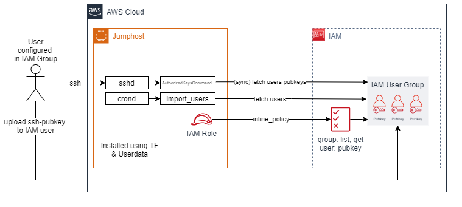

# aws-ec2-iam-ssh

**Only tested on Amazon Linux. Requires binaries (useradd, usermod, userdel, groupadd)**

## How to 

1. Add the [IAM-policy](aws-iam-policy.json) to the role of the ec2-instance. Make sure to replace `<name>` with the actual IAM group name
2. Log into the ec2 instance or configure its userdata
3. Make sure git is installed
4. Execute `git clone https://github.com/ron96G/aws-ec2-iam-ssh.git`
5. cd aws-ec2-iam-ssh/scripts
6. Make sure you are root: `whoami`
7. Setup variables in the [configfile](scripts/aws-ec2-iam-ssh.conf)
8. Execute the install script: `./install.sh`. It is installed into `/opt/iam-ssh/`

### To add a ssh pubkey to a IAM user:
1. Go to IAM -> Users -> YOUR_USER -> Security credentials -> SSH Keys for AWS CodeCommit
2. Click `Upload SSH public key`, paste your ssh pubkey into the field and save
3. When trying to connect using ssh, use your corresponding private key like `ssh -i <privkey_file> <user>@<host>`

### To generate a ssh key pair run:
`ssh-keygen -t rsa -b 4096 -f <filename>`

## Features

1. Automatically create users on the ec2-instance that are defined in the IAM group
2. Automatically remove these users when they are no longer defined in the IAM group
3. Execute custom scripts when a new user is created (requires absolute path to script)
4. Authorize ssh requests using the public keys configured for the users in the IAM group

## Further Readings

- https://man.openbsd.org/sshd_config#AuthorizedKeysCommand